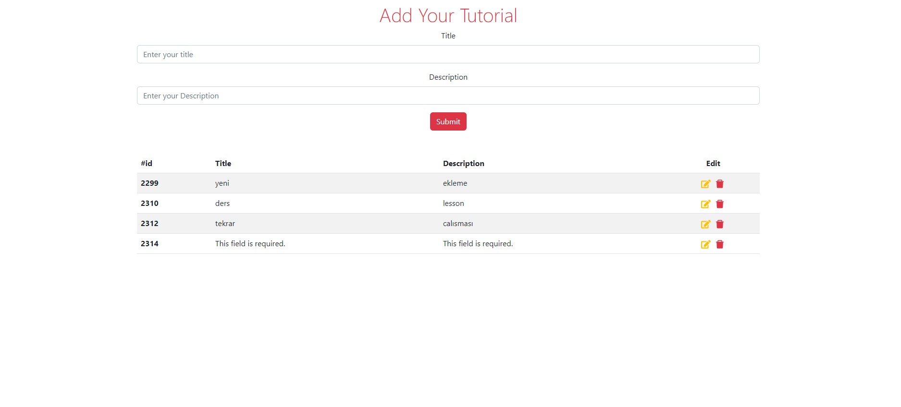

## Description
In this project, I worked on get, post, put and delete operations using axios.
 

## API Base URLs

https://tutorial-api.fullstack.clarusway.com/

### API ENDPOINTS

- GET `tutorials/` get all Tutorials
- GET `tutorials/:id/` get Tutorial by id
- POST `tutorials/` add new Tutorial
- PUT `tutorials/:id/` update Tutorial by id
- PATCH `tutorials/:id/` patch Tutorial by id
- DELETE `tutorials/:id/` remove Tutorial by id
- DELETE `tutorials/` remove all Tutorials

# Deployed Frontend

https://tutorial.fullstack.clarusway.com/
